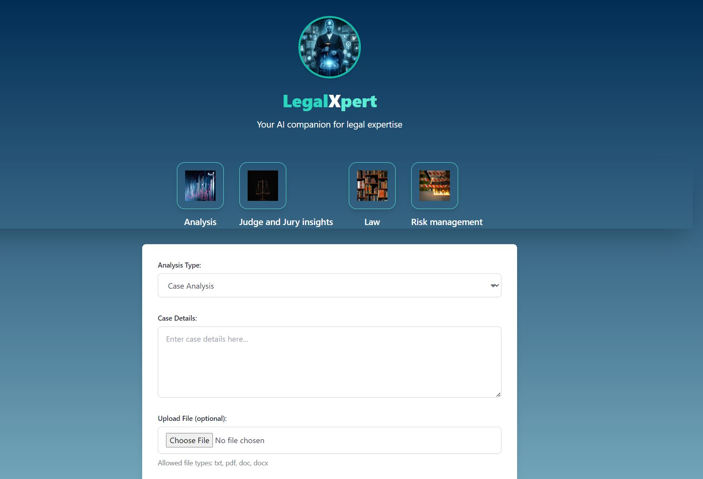

# AI-LegalXpert

**AI LegalXpert** is a sophisticated AI-powered legal assistant designed to assist users by providing comprehensive legal analysis, suggestions, and strategies. Leveraging the latest advancements in natural language processing and forensic image analysis, AI LegalXpert can analyze legal documents, visual evidence, and other case materials to provide actionable insights.

## Features

### 1. Document Analysis
- Upload legal documents in PDF, DOC, DOCX, or TXT formats.
- Receive a comprehensive analysis of the document’s content, including identification of key legal elements, potential issues, and strategic recommendations.

### 2. Forensic Image Analysis
- **AI ForensicXpert Integration:** An advanced AI assistant specialized in forensic image analysis, capable of detecting tampering, assessing image quality, and identifying key forensic evidence.
- **Detailed Reports:** Provide a thorough analysis of images covering aspects such as:
  1. **Image Content Description:** Reads and describes the content of images in detail.
  2. **Case-Relevant Element Identification:** Analyzes images to identify key elements relevant to the case.
  3. **Evidence Provision:** Extracts and provides evidence from images that can strengthen the case.
  4. **Inconsistency Highlighting:** Identifies and highlights any inconsistencies or issues present in the images.
  5. **Legal Argument Support:** Suggests how images can be used effectively in legal arguments.
  6. **Tampering and Manipulation Detection:** Detects any tampering or manipulation in images.
  7. **Image Quality and Integrity Analysis:** Analyzes the quality and integrity of images.
  8. **Forensic Evidence Identification:** Identifies significant forensic evidence within images.
  9. **Forensic Findings Recommendations:** Offers recommendations or insights based on forensic findings.

### 3. Legal Strategy Suggestions
- Receive tailored recommendations for legal strategies based on the analysis of documents and forensic evidence.
- Support for both civil and criminal cases, helping you navigate complex legal scenarios with expert guidance.

### 4. Result Export
- Save or export analysis results for later review, allowing for easy integration into your case management workflow.

## Use Cases
- **Legal Professionals:** Enhance case preparation with AI-driven analysis of legal documents and forensic evidence.
- **Law Enforcement:** Utilize forensic image analysis to support investigations and gather critical evidence.
- **Corporate Legal Departments:** Streamline document review and ensure compliance with regulatory requirements.

**AI LegalXpert** is designed to be an indispensable tool for legal professionals, combining cutting-edge AI technology with practical, real-world applications in the legal field.


## Demo

Check out the [AI LegalXpert Demo](https://0b1e-89-142-161-240.ngrok-free.app/) to see the application in action.


## Installation / Setup

Follow these steps to set up and run AI LegalXpert on your machine:
1. **Clone the repository:**

   ```bash
   git clone https://github.com/hrch3k/ai-legalxpert.git
   cd ai-legalxpert
   ```

2. **Install dependencies:**

  Make sure you have Python 3.10 installed, then install the required Python packages:

   ```bash
   pip install -r requirements.txt
   ```

3. **Set up environment variables:**

  Create a .env file in the root of the project with the following content:

   ```bash
   AWS_REGION_NAME=your_aws_region
   AWS_ACCESS_KEY_ID=your_access_key_id
   AWS_SECRET_ACCESS_KEY=your_secret_access_key
  ```


4. **Run the application:**

  Start the Flask development server by running:

   ```bash
   python app.py
```


## Example Usage

Here are some examples of how AI LegalXpert works:

### Document Upload and Analysis

1. **Upload a legal document**: Users can upload legal documents in PDF, DOC, DOCX, or TXT formats. The application will read and extract text from the document.

2. **Select Analysis Type**: Choose from comprehensive analysis, brief summary, or strategy-focused analysis.

3. **View Results**: The application provides detailed insights, including key legal issues, potential strengths and weaknesses, and recommended legal strategies.

### Screenshot Examples

- **App:**

  

  

- **View Results:**

  


- **image forensycs:**
  
  

## Contributing

If you would like to contribute to AI LegalXpert, please follow these steps:

1. **Fork the repository.**
2. **Create a new branch** (`git checkout -b feature-branch`).
3. **Make your changes and commit them** (`git commit -am 'Add new feature'`).
4. **Push to the branch** (`git push origin feature-branch`).
5. **Create a new Pull Request.**

## License

AI LegalXpert is licensed under the MIT License. See `LICENSE` for more information.

## Contact

For any questions or issues, feel free to open an issue.

